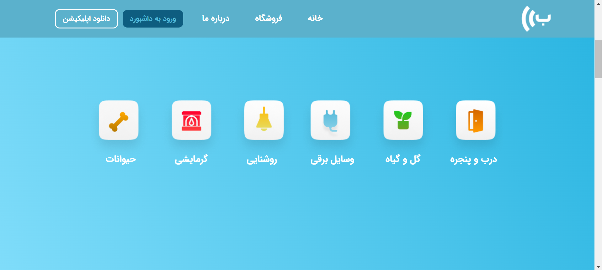
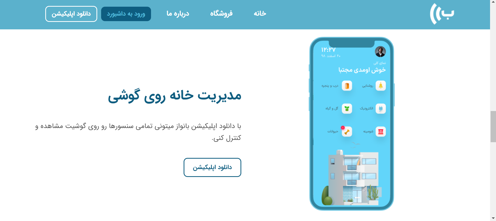
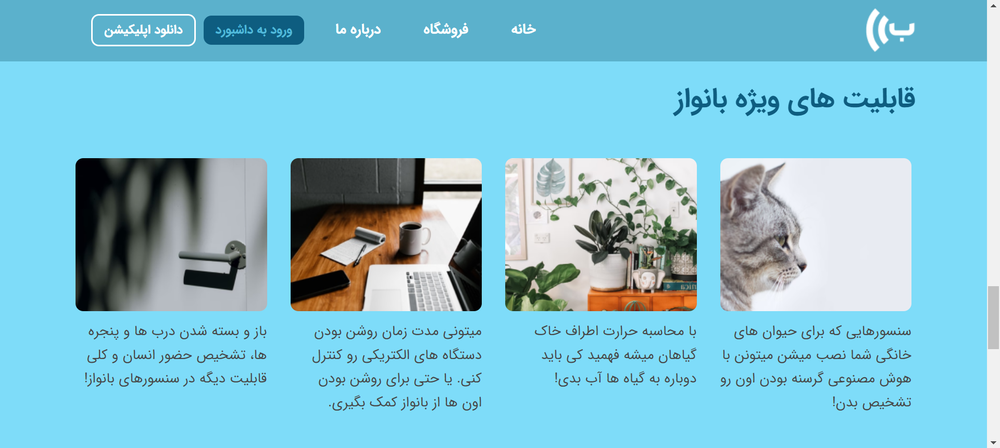
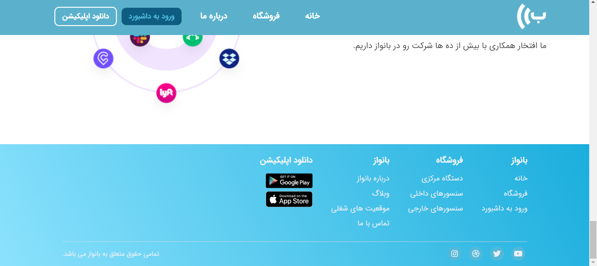
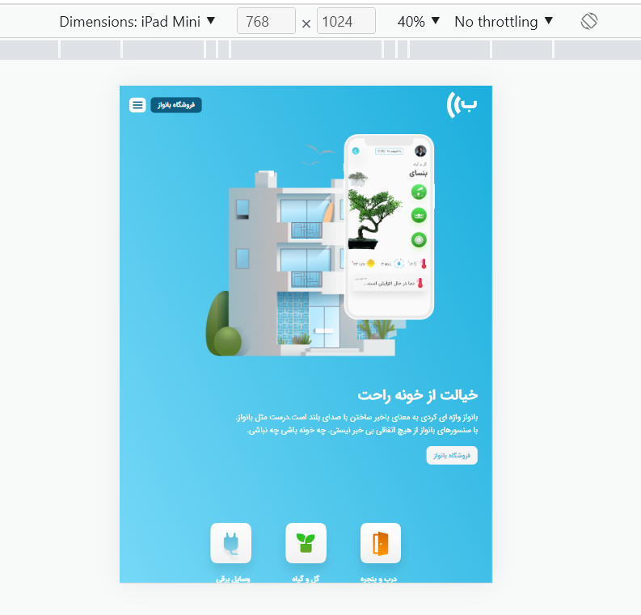
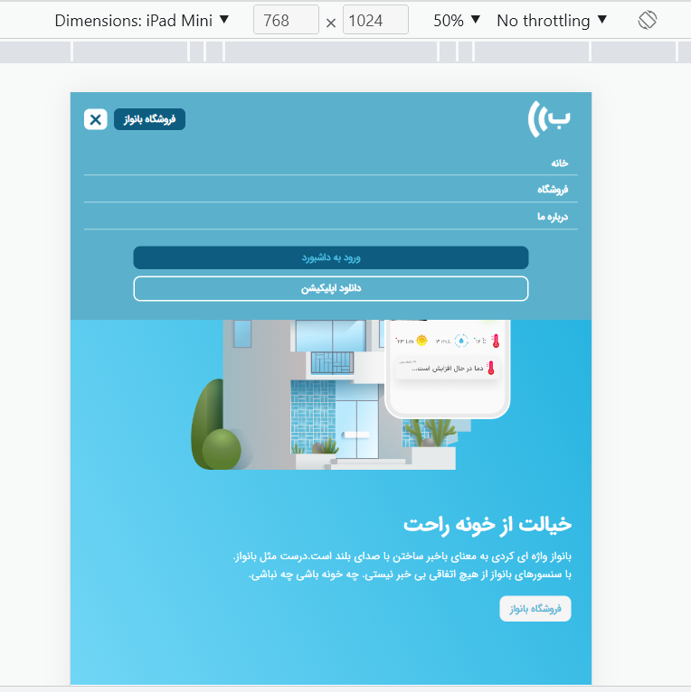
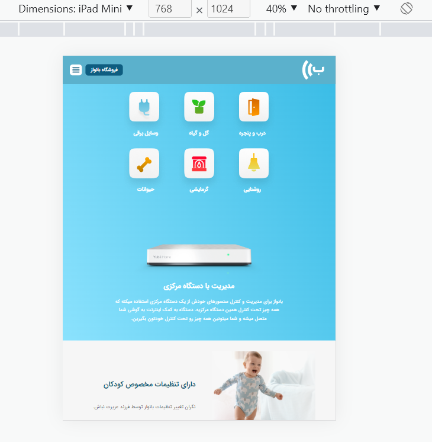
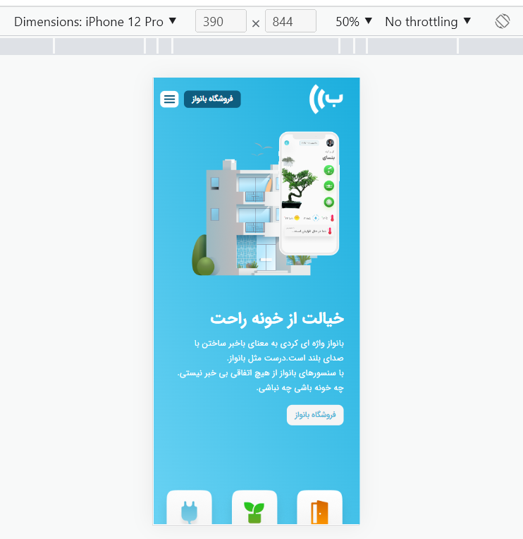
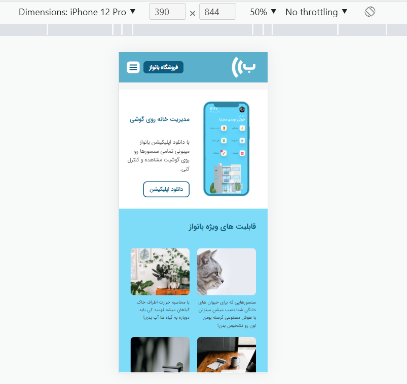
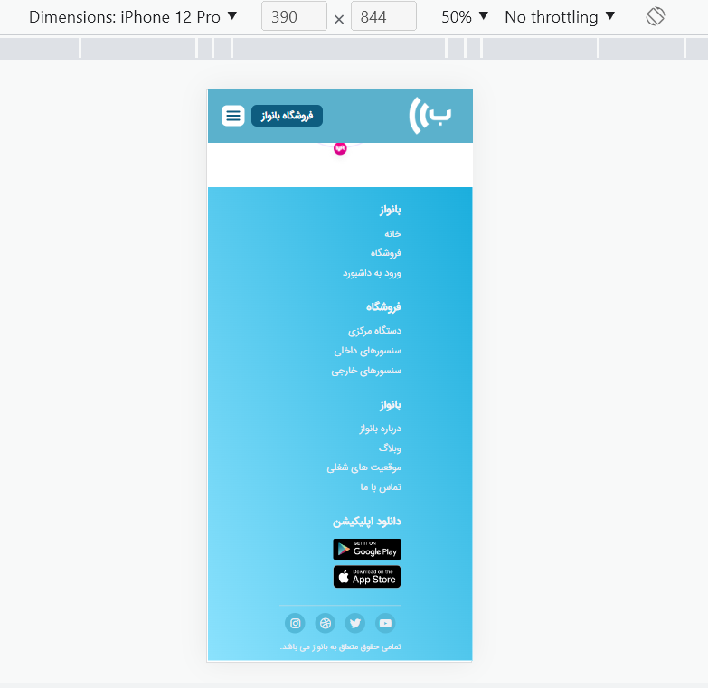

# Banvaaz_Project

This project is implementing the UI of banvaaz website. The project is responsive in different device sizes. Demo on [Vercel](https://banvaaz-project.vercel.app/).

## Technologies

- HTML5
- CSS3
- JavaScript

## Screenshots

- **Desktop size**

- **Tablet size**

- **Mobile size**

